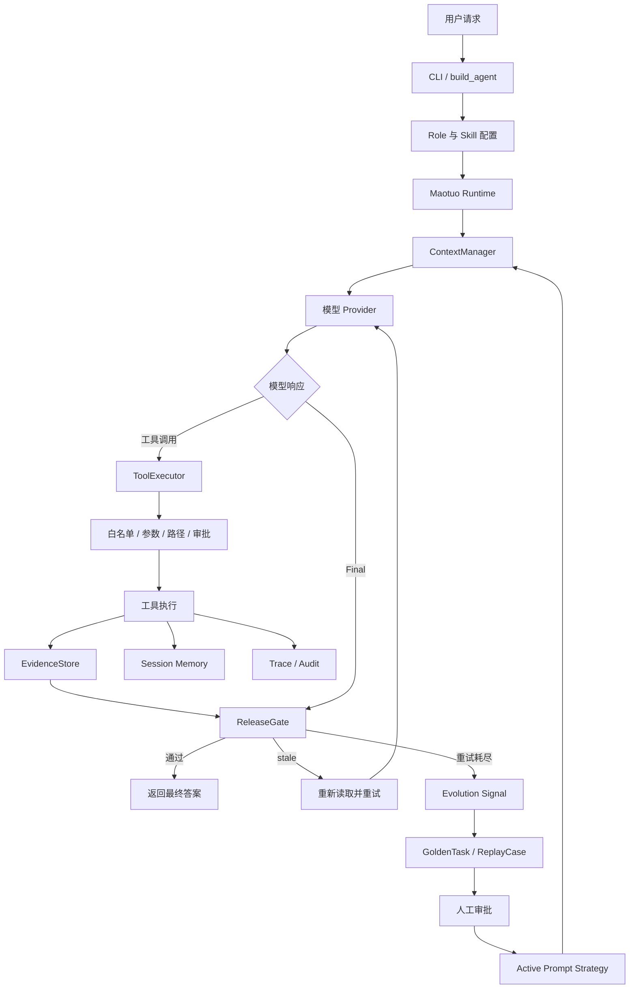

# Maotuo

Maotuo 是一个从零实现的轻量级、安全可审计、支持垂类定制和受控自进化的 Coding Agent Runtime。

它运行在本地代码仓库中，负责把模型的自然语言决策转换成受约束的工具操作，并对工具执行、文件证据、最终答案、失败恢复和提示策略演进进行持久化记录。

Maotuo 的核心定位不是“另一个聊天机器人”，而是：

> 模型负责提出行动建议，Runtime 负责决定行动是否允许，证据链负责决定结果是否可信，评测和人工审批负责决定系统如何改进。

## 目录

- [项目定位](#项目定位)
- [核心能力](#核心能力)
- [整体架构](#整体架构)
- [一次任务如何闭环](#一次任务如何闭环)
- [快速开始](#快速开始)
- [模型 Provider 配置](#模型-provider-配置)
- [CLI 使用](#cli-使用)
- [Role 与 Skill](#role-与-skill)
- [工具安全模型](#工具安全模型)
- [安全证据链](#安全证据链)
- [失败恢复与 Checkpoint](#失败恢复与-checkpoint)
- [受控自进化](#受控自进化)
- [GoldenTask 与 ReplayCase](#goldentask-与-replaycase)
- [运行产物](#运行产物)
- [模块职责和调用关系](#模块职责和调用关系)
- [项目结构](#项目结构)
- [测试与验证](#测试与验证)
- [私有化部署](#私有化部署)
- [设计原则](#设计原则)
- [当前边界与后续规划](#当前边界与后续规划)

## 项目定位

Maotuo 面向以下场景：

- 在本地仓库中分析代码、定位问题和修复测试。
- 让模型使用受限制的文件、搜索、Shell 和补丁工具。
- 在工具执行后记录文件变更和证据。
- 在最终答案返回前检查依据文件是否已经过期。
- 通过 Role 和 Skill 适配安全审查、Python 开发、测试修复等垂直场景。
- 将失败任务自动沉淀为可回放案例，但不自动修改安全规则或工具白名单。
- 适配企业内网模型网关和本地私有化环境。

Maotuo 保持轻量，核心实现只使用 Python 标准库和项目自身代码，不引入 LangChain、AutoGen、CrewAI 等 Agent 框架。

## 核心能力

### 1. 受约束的工具执行

模型不能直接调用操作系统或文件系统。所有工具调用都必须经过统一的 `ToolExecutor`：

```text
模型输出
  ↓
解析工具名称和参数
  ↓
Role / 全局工具白名单
  ↓
工具存在性检查
  ↓
参数校验
  ↓
路径边界检查
  ↓
重复调用检查
  ↓
高风险操作审批
  ↓
执行工具
  ↓
记录结果、证据和审计事件
```

当前内置工具包括：

| 工具 | 默认风险 | 能力 |
| --- | --- | --- |
| `list_files` | 低 | 查看工作区文件列表 |
| `read_file` | 低 | 按行读取 UTF-8 文件 |
| `search` | 低 | 在工作区中搜索文本 |
| `run_shell` | 高 | 在仓库根目录执行 Shell 命令 |
| `write_file` | 高 | 创建或覆盖文本文件 |
| `patch_file` | 高 | 对文件执行精确文本替换 |
| `delegate` | 高 | 创建受深度限制的子任务 |

### 2. 安全证据链

每次工具执行后，Maotuo 会收集工具涉及文件的 SHA256，并将证据写入当前运行的报告和 trace。

最终答案返回前，`ReleaseGate` 会重新计算证据文件的 SHA256：

```text
文件未变化
  → 允许发布 final

文件发生变化、被删除或无法读取
  → 写入 stale trace
  → 下一轮 Prompt 要求重新读取
  → 阻止当前 final
  → 最多重试 2 次
  → 仍失败则终止任务并生成进化信号
```

Evidence 按 Run 隔离。同一个 `Maotuo` 实例连续执行多个 `ask()` 时，新的 Run 会清空旧 Run 的 Evidence，避免历史任务污染当前发布判断。

### 3. Role 与 Skill

`Role` 解决“当前 Agent 是谁、允许做什么”：

- 定义身份和基础行为约束。
- 限制工具白名单。
- Role 权限只能收缩全局工具权限，不能扩大底层能力。

`Skill` 解决“当前 Agent 掌握什么领域知识”：

- 根据用户请求关键词激活。
- 按优先级排序。
- 注入领域安全检查、编码规范或测试知识。

Role 和 Skill 内容放在 Prompt 的受保护前缀区域，普通上下文裁剪时优先保留。

### 4. 受控自进化

任务失败或 stale 重试耗尽时，Maotuo 会：

1. 记录失败信号。
2. 生成提示策略候选。
3. 自动运行 GoldenTask 和 ReplayCase。
4. 将评测结果写入候选的 `evaluation` 字段。
5. 只有评测通过且人工审批后，候选才能激活。

自进化只允许修改 Prompt 策略，不允许修改：

- 工具白名单。
- 路径安全规则。
- Shell 环境白名单。
- 审批策略。
- ReleaseGate 规则。

### 5. 可恢复状态和审计工件

Maotuo 将以下信息分别持久化：

- Session：跨任务会话状态。
- Run：单次运行的过程和结果。
- Checkpoint：任务中断后的恢复点。
- Trace：完整事件时间线。
- Audit：安全相关事件。
- Report：一次运行的最终摘要。
- Evidence：文件证据哈希。

## 整体架构



## 一次任务如何闭环

一次 `agent.ask(user_message)` 的生命周期如下：

### 1. 创建 Run

`AgentLoop` 创建 `TaskState`，生成 `run_id` 和 `task_id`，并清理当前运行级状态：

- ReleaseGate 重试计数。
- pending stale 文件列表。
- EvidenceStore 文件证据。

### 2. 构建 Prompt

`ContextManager` 按优先级组装：

1. Role / Skill 保护内容。
2. 稳定工作区前缀。
3. 工作记忆。
4. 相关记忆。
5. 历史工具结果。
6. 当前用户请求。

上下文超过预算时，优先压缩普通历史和记忆，Role / Skill 保护内容优先保留。

### 3. 请求模型

Provider Client 负责向模型服务发送 Prompt。Maotuo 支持文本形式的工具协议：

```xml
<tool>{"name":"read_file","args":{"path":"README.md","start":1,"end":80}}</tool>
```

或：

```xml
<final>任务完成。</final>
```

每次模型响应都会写入脱敏后的 `model_parsed` trace，失败时可以用于生成 ReplayCase。

### 4. 工具执行

所有工具都经过统一执行入口。工具返回的不只是文本，还会附带结构化 metadata：

```json
{
  "tool_status": "ok",
  "tool_error_code": "",
  "security_event_type": "",
  "risk_level": "low",
  "read_only": true,
  "affected_paths": [],
  "workspace_changed": false,
  "diff_summary": []
}
```

### 5. 最终答案检查

模型返回 final 后，Maotuo 不会立即把答案交给用户，而是先执行 ReleaseGate：

```python
gate_result = agent.check_release_gate()

if gate_result["allowed"]:
    return final

if gate_result["retryable"]:
    # 下一轮 Prompt 会要求模型重新读取 stale 文件
    continue

# 重试耗尽，任务失败
```

## 快速开始

### 环境要求

- Python 3.10 或更高版本。
- 一个可访问的模型 Provider，或者本地 Ollama。
- 当前用户对项目工作区具有读写权限。

### 安装

Maotuo 没有运行时第三方依赖：

```bash
python -m pip install -e .
```

安装开发测试依赖：

```bash
python -m pip install pytest ruff
```

也可以使用 `uv`：

```bash
uv sync
```

### 启动

```bash
python -m maotuo
```

指定工作区：

```bash
python -m maotuo --cwd /path/to/project
```

一次性执行 Prompt：

```bash
python -m maotuo --cwd /path/to/project "检查当前项目的安全问题"
```

查看帮助：

```bash
python -m maotuo --help
```

## 模型 Provider 配置

配置优先级：

```text
显式 CLI 参数 > .env 中的 MAOTUO_* > 兼容旧变量 > 代码默认值
```

复制环境变量模板：

```bash
copy deploy\.env.maotuo.example .env
```

Linux/macOS：

```bash
cp deploy/.env.maotuo.example .env
```

### DeepSeek

```bash
MAOTUO_PROVIDER=deepseek
MAOTUO_DEEPSEEK_API_BASE=https://api.deepseek.com/anthropic
MAOTUO_DEEPSEEK_API_KEY=your-api-key
MAOTUO_DEEPSEEK_MODEL=deepseek-v4-flash
```

### OpenAI-compatible Provider

```bash
MAOTUO_PROVIDER=openai
MAOTUO_OPENAI_API_BASE=https://api.example.com/v1
MAOTUO_OPENAI_API_KEY=your-api-key
MAOTUO_OPENAI_MODEL=your-model
```

### Anthropic-compatible Provider

```bash
MAOTUO_PROVIDER=anthropic
MAOTUO_ANTHROPIC_API_BASE=https://api.example.com
MAOTUO_ANTHROPIC_API_KEY=your-api-key
MAOTUO_ANTHROPIC_MODEL=your-model
```

### Ollama

```bash
python -m maotuo --provider ollama --host http://127.0.0.1:11434 --model qwen3.5:4b
```

真实密钥不要提交到 Git 仓库。`.env` 默认被 `.gitignore` 忽略。

## CLI 使用

### 基本参数

```bash
python -m maotuo \
  --cwd ./demo-project \
  --provider deepseek \
  --model deepseek-v4-flash \
  --max-steps 6 \
  --max-new-tokens 512
```

### 审批策略

高风险工具默认需要审批：

```bash
python -m maotuo --approval ask
```

自动批准仅建议用于受控测试目录，不建议直接用于生产工作区。

### Session 恢复

恢复最近会话：

```bash
python -m maotuo --resume latest
```

恢复指定会话：

```bash
python -m maotuo --resume SESSION_ID
```

### 评测命令

```bash
python -m maotuo --evaluate golden
python -m maotuo --evaluate replay
python -m maotuo --evaluate all
```

运行本地真实代码任务评测：

```bash
python -m maotuo.evaluation.real_benchmark --validate-only
python -m maotuo.evaluation.real_benchmark --provider deepseek --model deepseek-v4-flash --ablation --pilot --repetitions 1 --artifact-root artifacts/maotuo-ablation-pilot
# 小样本趋势确认后，再运行完整 24 任务 × 4 组 × 2 次评测。
python -m maotuo.evaluation.real_benchmark --provider deepseek --model deepseek-v4-flash --ablation --repetitions 2 --artifact-root artifacts/maotuo-ablation-full
python -m maotuo.evaluation.benchmark_report \
  --ablation artifacts/maotuo-ablation-full/ablation-summary.json \
  --output artifacts/maotuo-ablation-full/ablation-report.md
```

这套评测包含 24 个本地 Python 任务，每个任务都有独立工作区、允许工具、步数预算和真实 verifier；
四组使用同一任务集、同一模型和同一解码参数，差异只来自运行时增强开关。

最新正式消融评测完成了 24 个任务 × 4 组配置 × 2 次重复，共 192 次 Agent 运行：

| 配置 | 任务通过率 | 预算内完成率 | GoldenTask |
| --- | ---: | ---: | ---: |
| Baseline | 72.92% | 100% | 75% |
| Prompt Only | 70.83% | 100% | 75% |
| Prompt + Context | 85.42% | 100% | 75% |
| Full | 81.25% | 100% | 100% |

其中，Prompt + Context 相较 Prompt Only 提升 14.59 个百分点；Full 相较 Baseline 提升 8.33 个百分点，Full 的核心安全回归达到 100%。Full 末轮 Prompt 平均字符数为 7285.75，相较 Prompt Only 的 10592.58 减少 31.22%。

评测原始 JSON、运行 trace 和本地工作区默认写入 `artifacts/`，不会进入版本库；如需复核，可根据上面的命令在本地重新生成。自进化 A/B 的 4 个训练场景和 4 个封闭 ReplayCase 的数据口径见 [`benchmarks/README.md`](benchmarks/README.md)。

评测结果写入：

```text
.maotuo/evaluations/golden.json
.maotuo/evaluations/replay.json
```

### 自进化候选

查看候选：

```bash
python -m maotuo --list-evolution
```

批准候选：

```bash
python -m maotuo --approve-evolution prompt-xxxxxxxxxx
```

审批要求：

- 候选必须存在。
- 候选必须有 `evaluation` 字段。
- `evaluation.approval_ready` 必须为 `true`。
- 评测失败、评测异常或旧格式候选默认拒绝激活。

## Role 与 Skill

项目根目录的 `maotuo.config.json` 负责配置 Role、Skill 和默认 Provider。

当前配置示例：

```json
{
  "provider": "deepseek",
  "role": "implementation-agent",
  "skills": ["python-security"],
  "roles": {
    "secure-reviewer": {
      "base_prompt": "你是一名安全代码审查 Agent。先读取证据，再给出可验证结论。",
      "allowed_tools": ["list_files", "read_file", "search", "run_shell"]
    },
    "implementation-agent": {
      "base_prompt": "你是一名谨慎的实现 Agent。修改前先理解现有代码和测试。",
      "allowed_tools": [
        "list_files",
        "read_file",
        "search",
        "run_shell",
        "write_file",
        "patch_file"
      ]
    }
  },
  "skill_definitions": {
    "python-security": {
      "keywords": ["安全", "漏洞", "鉴权", "权限", "token", "secret"],
      "priority": 100,
      "prompt_fragment": "重点检查输入校验、路径逃逸、命令注入、敏感信息泄露和权限边界。"
    }
  }
}
```

启动时指定 Role：

```bash
python -m maotuo --role secure-reviewer
```

指定 Skill：

```bash
python -m maotuo --skill python-security
```

指定多个 Skill：

```bash
python -m maotuo --skill python-security --skill python-quality
```

Role 和 Skill 的职责边界：

| 能力 | Role | Skill |
| --- | --- | --- |
| Agent 身份 | 是 | 否 |
| 工具白名单 | 是 | 否 |
| 领域知识 | 可包含基础规则 | 是 |
| 关键词激活 | 否 | 是 |
| 安全规则修改 | 不允许 | 不允许 |

## 工具安全模型

### 路径边界

所有文件工具都通过工作区路径解析器，拒绝：

- `../` 路径逃逸。
- 工作区外绝对路径。
- 解析后指向工作区外的路径。
- 不符合工具参数约束的路径。

### 高风险审批

以下操作默认需要审批：

- `run_shell`
- `write_file`
- `patch_file`
- `delegate`

审批策略由 Runtime 控制，不由模型自行决定。

### Shell 环境

Shell 不直接继承完整父进程环境，而是使用环境变量白名单，以减少 API Key 和其他敏感信息泄露风险。

### 敏感信息脱敏

Trace、Report 和审计数据会对敏感环境变量和常见密钥形态执行脱敏：

```text
sk-example-secret
  ↓
<redacted>
```

可以通过 `MAOTUO_SECRET_ENV_NAMES` 或 CLI 的 `--secret-env-name` 增加自定义敏感变量。

## 安全证据链

EvidenceStore 的职责是保存当前 Run 观察到的文件证据：

```python
FileEvidence(
    path="maotuo/runtime.py",
    sha256="...",
    source="read_file",
    observed_at="...",
)
```

每个 Run 都有独立的 EvidenceStore 状态：

```python
agent.evidence_store.start_run(task_state.run_id)
```

ReleaseGate 的默认行为：

```text
最大 stale 重试次数：2
```

当 stale 出现时，系统会同时执行：

1. 写入 `stale_detected` trace。
2. 写入安全审计事件。
3. 将文件路径写入下一轮 Prompt。
4. 阻止当前 final。
5. 触发重新读取。
6. 重试耗尽后生成 `stale_retry_exhausted` 信号。

## 失败恢复与 Checkpoint

Checkpoint 用于保存可恢复的任务状态，包括：

- 当前任务 ID。
- 当前 Run ID。
- 用户请求。
- 当前工作区指纹。
- 工具签名。
- 已读取的关键文件。
- 当前目标和阻塞原因。
- Runtime Identity。

恢复时会检查：

- 工作区是否变化。
- 关键文件是否 stale。
- 工具集合是否变化。
- Provider 和审批策略是否变化。
- Checkpoint schema 是否兼容。

不满足恢复条件时，Maotuo 会标记为 partial-stale、workspace-mismatch 或 schema-mismatch，而不是静默复用旧状态。

## 受控自进化

自进化信号来源包括：

- 模型请求失败。
- malformed model response 重试耗尽。
- 工具步数耗尽。
- stale 重试耗尽。
- 其他 Runtime 任务失败。

候选数据示例：

```json
{
  "candidate_id": "prompt-xxxxxxxxxx",
  "source": "stale_retry_exhausted",
  "proposal": "回答前必须重新读取所有 stale 文件，并基于最新内容作答。",
  "scope": "prompt_strategy",
  "status": "pending_approval",
  "version": 1,
  "evaluation": {
    "status": "passed",
    "approval_ready": true,
    "total": 6,
    "passed": 6,
    "pass_rate": 1.0
  }
}
```

候选生成后自动运行：

```text
4 个 GoldenTask
2 个 ReplayCase
```

目前候选评测主要用于验证 Runtime 安全回归基线。候选提示策略本身的 A/B 效果评测仍然是后续增强方向。

## GoldenTask 与 ReplayCase

### GoldenTask

GoldenTask 是固定的安全不变量测试，目前包括：

1. 路径逃逸必须拒绝。
2. 高风险工具必须经过审批。
3. Evidence stale 时不能直接发布。
4. 敏感信息不能出现在输出中。

### ReplayCase

ReplayCase 用于回放历史模型输出，验证过去失败场景是否仍然能够稳定处理。

失败任务结束后，Maotuo 会自动从当前 Run 的 `trace.jsonl` 抽取：

- 用户请求。
- 脱敏后的模型原始输出序列。
- 停止原因。
- 来源 trace。

案例会先保存为：

```text
status = pending_review
```

原因是失败 trace 本身没有可信的正确答案。人工补充 `expected_final` 后，再改为：

```text
status = ready
```

`run_replay_cases()` 会自动加载：

- 包内内置 ReplayCase。
- 项目 `.maotuo/evaluation/replay_cases.json` 中的 ready 案例。

pending 案例默认不会参与评测。

## 运行产物

每次运行的产物位于：

```text
.maotuo/
├── sessions/
│   └── <session_id>.json
├── runs/
│   └── <run_id>/
│       ├── task_state.json
│       ├── trace.jsonl
│       ├── audit.jsonl
│       └── report.json
├── evolution/
│   └── candidates.json
├── evaluation/
│   └── replay_cases.json
└── evaluations/
    ├── golden.json
    └── replay.json
```

### trace.jsonl

完整的运行事件时间线，例如：

- `run_started`
- `prompt_built`
- `model_requested`
- `model_parsed`
- `tool_executed`
- `tool_evidence_recorded`
- `stale_detected`
- `stale_retry_requested`
- `replay_case_extracted`
- `run_finished`

### audit.jsonl

只保存安全相关事件，避免把完整模型上下文重复复制一份。适合用于安全审计和问题复盘。

### report.json

一次运行的最终摘要，包括：

- 运行状态。
- 停止原因。
- 工具步数和模型尝试次数。
- Checkpoint 信息。
- Prompt metadata。
- Evidence。
- 进化信号。
- 当前 Prompt strategy。

## 模块职责和调用关系

| 模块 | 主要职责 | 消费者 | 调用方 |
| --- | --- | --- | --- |
| `runtime.py` | Runtime 门面和运行状态装配 | CLI、AgentLoop | `Maotuo.ask()` |
| `agent_loop.py` | 感知、决策、行动、记录主循环 | Maotuo | `ask()` |
| `tool_executor.py` | 工具执行总闸口 | Runtime | AgentLoop |
| `tools.py` | 工具定义、参数校验和实际执行 | ToolExecutor | ToolExecutor |
| `evidence.py` | 文件 SHA256 和 ReleaseGate | Runtime、Report | Tool 执行和 final 阶段 |
| `role_skill.py` | Role 工具权限和 Skill Prompt | Runtime、ContextManager | CLI、Runtime |
| `context_manager.py` | Prompt 预算和上下文裁剪 | Model Provider | AgentLoop |
| `checkpoint.py` | 任务恢复和 Runtime Identity | Runtime、Session | 每次工具执行和恢复 |
| `run_store.py` | Run 工件、Trace、Audit、Report | CLI、复盘工具 | AgentLoop、Runtime |
| `evolution.py` | 失败信号、候选和审批 | Prompt 注入、CLI | AgentLoop |
| `evaluation/replay.py` | Golden/Replay 评测和失败案例抽取 | Evolution、CI、CLI | 候选生成、失败收尾 |
| `providers/clients.py` | 模型 Provider 适配 | AgentLoop | CLI 装配 |

## 项目结构

```text
maotuo/
├── maotuo/
│   ├── __init__.py              # 公共 API
│   ├── __main__.py              # python -m maotuo 入口
│   ├── cli.py                   # CLI 和 Provider 装配
│   ├── runtime.py               # Runtime 门面
│   ├── agent_loop.py            # Agent 主循环
│   ├── tool_executor.py         # 工具执行控制层
│   ├── tools.py                 # 工具定义和执行
│   ├── evidence.py              # Evidence 和 ReleaseGate
│   ├── role_skill.py             # Role / Skill
│   ├── evolution.py             # 受控自进化
│   ├── context_manager.py       # Prompt 上下文管理
│   ├── prompt_prefix.py         # 稳定 Prompt 前缀
│   ├── task_state.py             # 任务状态机
│   ├── checkpoint.py             # Checkpoint 和恢复
│   ├── session_store.py          # Session 持久化
│   ├── run_store.py              # Run 工件持久化
│   ├── security.py               # 脱敏和安全辅助函数
│   ├── workspace.py               # 工作区扫描和路径边界
│   ├── providers/                # Provider Client
│   ├── features/memory.py        # 分层记忆
│   └── evaluation/               # GoldenTask / ReplayCase
├── tests/                        # pytest 测试
├── deploy/                       # 私有化部署说明和环境模板
├── benchmarks/                   # 本地任务集、Verifier 和评测入口
├── docs/architecture/            # Runtime 架构说明
├── maotuo.config.json            # 项目级 Role / Skill 配置
├── pyproject.toml                # 包和测试配置
└── README.md                     # 项目说明
```

## 测试与验证

运行完整测试：

```bash
python -m pytest -q
```

运行指定测试：

```bash
python -m pytest -q tests/test_evolution_controls.py
python -m pytest -q tests/test_safety_invariants.py
python -m pytest -q tests/test_context_manager.py
```

运行编译检查：

```bash
python -m compileall -q maotuo
```

运行离线安全评测：

```bash
python -m maotuo --evaluate all
```

Windows 环境运行完整测试时可能遇到两个环境限制：

1. Windows 默认没有 Linux `printf` 命令。
2. 创建 symlink 需要 Windows Developer Mode 或额外权限。

它们不代表 Maotuo 核心逻辑失败，建议在 CI 的 Linux 环境中再次运行完整安全测试。

## 私有化部署

Maotuo 的私有化部署不要求 Web 框架或 Agent 框架，最小部署单元包括：

- Python 3.10+。
- Maotuo 项目代码。
- 企业内网模型 Gateway 或本地 Ollama。
- 一个受控代码工作区。
- 本地 `.maotuo` 审计目录。

推荐网络边界：

```text
Maotuo Runtime → 企业模型网关
Maotuo Runtime → 本地代码工作区
模型工具      ↛ 公网
```

生产环境建议进一步增加：

- Shell 网络策略。
- 命令白名单。
- 容器或操作系统级沙箱。
- 用户身份和租户隔离。
- 远程不可篡改审计存储。
- CI 中的 GoldenTask / ReplayCase 门禁。

部署说明见 [deploy/README.md](deploy/README.md)。

## 设计原则

### 保持轻量

不引入大型 Agent 编排框架，尽量使用：

- Python 标准库。
- 明确的 Runtime 状态。
- 小型数据结构。
- 文件型本地持久化。

### 增量增强

安全证据、Role、Skill、Evolution 和 Evaluation 都挂载在原有 Runtime、ToolExecutor、Session 和 Trace 之上，不重写基础执行逻辑。

### 安全默认拒绝

- 未知工具拒绝。
- 越界路径拒绝。
- 高风险操作需要审批。
- stale final 拒绝发布。
- 未通过评测的候选拒绝激活。
- 未确认的 ReplayCase 不参与回归评测。

### 规则和策略分离

自进化只允许调整提示策略，不允许借助 Prompt 改变 Runtime 安全边界。

### 可审计优先

每个重要安全决策都尽量留下：

- 输入。
- 决策。
- 执行动作。
- 结果。
- 证据。
- 时间。
- Run ID。

## 当前边界与后续规划

### 当前仍需增强的部分

1. `run_shell` 仍然是强能力入口，需要进一步增加 offline 网络策略和命令沙箱。
2. 搜索和 Shell 读取行为需要继续增强文件级事实来源记录。
3. 候选 Prompt 已具备 4 train + 4 holdout 的 A/B 评测入口，正式结论应以真实 Provider 的可复现实验为准。
4. 当前审计数据主要落在本地文件，尚未包含多租户身份和远程不可篡改存储。
5. 上下文预算目前主要按字符估算，后续可增加更精确的 token 估算。

### 建议路线

```text
P0：Evidence 完整来源链 + Shell 网络边界
P0：Provider 可用后重新运行真实模型质量评测并冻结简历数据
P1：RunContext 并发隔离
P1：增量式工作区快照
P1：Checkpoint 纳入 Role / Skill / Prompt Strategy 版本
P2：真实 Provider 质量评测
P2：远程审计和多租户部署
```

## 项目状态

Maotuo 当前已经形成以下闭环：

```text
工具约束
  + 文件证据
  + stale 阻断和重试
  + Role / Skill 垂类定制
  + 失败信号收集
  + Golden / Replay 自动评测
  + 人工审批激活
  + Trace / Audit / Report 持久化
```

它适合作为一个面向安全私有化 Coding Agent 的 Runtime 基础项目，也适合作为后续垂直领域 Agent 的执行底座。
